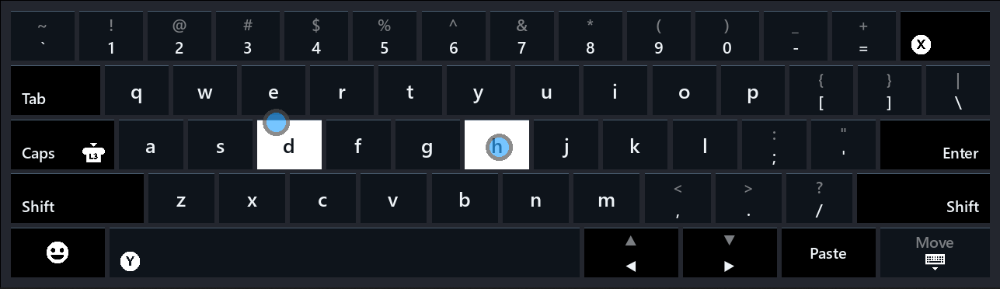

# SteamlessKeyboard
SteamlessKeyboard aims to make the Steam Controller (2026) more useful when Steam is not running
> ⚠️ **Requires the May 22, 2026 Steam Controller firmware update.** This program will not work with earlier firmware.

## Features
- Works on Windows without Steam running
- Recreates Steam's on-screen keyboard
- Translates Steam Controller inputs into a Xbox 360 gamepad
- Smart gamepad mode — Smooth switching between gamepad and lizard mode

### To do
- Add emoji menu support
- Expanded real-world testing
- Linux release
- Multiple language support?
- Rumble
- Renaming
- Remapper
- Debug menu toggle

---

## Installation

### 1. Install the ViGEmBus driver

[github.com/nefarius/ViGEmBus/releases](https://github.com/nefarius/ViGEmBus/releases)

Run it and follow the prompts. You only need to do this once. The keyboard will still work without it, but gamepad mode will be unavailable.

### 2. Download SteamlessKeyboard

- Grab `SteamlessKeyboard.exe` from the [Releases page](https://github.com/PietPetGit/SteamlessKeyboard/releases)
- Drop it anywhere on your machine and run it

### 3. Configure startup behavior (optional)
Right-click the  tray icon to toggle:
|  |  |
|--------|-------------|
| **Start with Windows** | Auto-launch on boot |
| **Disable While Steam Is Running** | Pause listener when Steam is active (lets Steam grab the controller) |
| **Exit on Steam Launch** | Fully exit the app when Steam starts |
| | |
| **Gamepad Mode → Auto-enable** | Automatically activate gamepad mode when a game is detected in the foreground *(default)* |
| **Gamepad Mode → Always On** | Keep gamepad mode on at all times (disables mouse/kb controls) |
| **Gamepad Mode → Off** | Disable virtual gamepad entirely |

---

## Controller Keybinds

| Input | Action |
|-------|--------|
|  +  | Open the on-screen keyboard |
|  +  | Alt+Tab — hold Steam to keep the switcher open; each VIEW press advances one slot |
|  +  | Hold Steam button to use the trackpad as a mouse while in gamepad mode |
|  +  | Volume up — tap for one step, hold to ramp |
|  +  | Volume down — tap for one step, hold to ramp |
|  +  | Previous song |
|  +  | Next song |
|  +  | Play / pause (click the left stick in) |
|  +  | Turn off the controller |

---

## Credits

- Forked from [archshift/adusk](https://github.com/archshift/adusk)
- Gamepad translation inspired by [ddeverill/SteamlessController](https://github.com/ddeverill/SteamlessController)
- Virtual gamepad driver by [Nefarius/ViGEmBus](https://github.com/nefarius/ViGEmBus)
